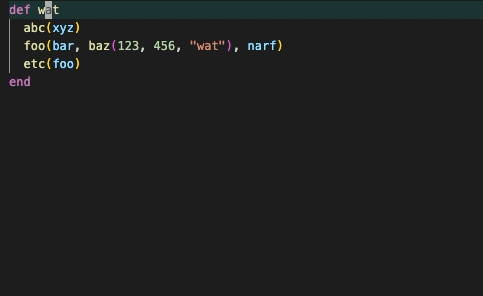

# vscode-argwrap

This is a (work-in-progress) VS Code port of the [vim plugin argwrap](https://github.com/FooSoft/vim-argwrap). It spreads out comma-separated items, such as list entries or function arguments, onto their own indented lines:

This plugin is compatible with, but does not require, the [VS Code vim plugin](https://github.com/VSCodeVim/Vim).
## Setup

There's currently no default binding. To use the plugin, bind a key to the `argwrap.toggle` command.